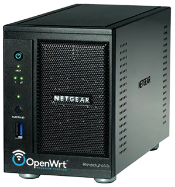

# Hard revive a Netgear ReadyNAS Pro 2 with OpenWrt

Full process to install OpenWRT on a Netgear ReadyNAS Pro 2 (RNDP2000 / RNDP2210).

## Purpose

The original Raidiator 4 OS became nearly unusable :
- Not maintained anymore, no more updates
- Outdated features protocols so most of the services are unusables, unsafes or slow.

But the hardware specs are still very good for this usage and make this device still valuable for a small office or home usage.

I saw afterwards some people managed to [upgrade Raidiator 4 to version 6](https://blah.cloud/miscellaneous/upgrading-a-legacy-readynas-from-raidiator-4-2-x-to-6-2-x/). But by the time i had already ripped the EMMC, and haven't managed to revert to the official firmware to give it a try.

So after a few successfull tries with debian and ubuntu server, i finally decided to install OpenWrt on it.

Installing OpenWrt to this NAS will allow many priceless network features for free 
- Router / Firewall / Proxy
- DHCP / DNS
- File Sharing
- and a lot more...

Also OpenWrt is very optimized to run on small devices with very few resources.

This page is about how i made it.

## The device

- Product name : NETGEAR ReadyNAS Pro 2
- Model : RNDP2000 / RNDP2210
- CPU : Intel Atom D525
- Memory : 1 x DDR3 1600 SODIMM (max capacity 2GB)
- Ethernet : 2 x RJ45 Gigabit Ethernet
- USB : 2 x USB 2.0 (back) + 1 x USB 3.0 (front)
- 2 x SATA 3.5" (possible RAID0/1)
- 125MB integrated EMMC.
- Completely outdated features protocols and web admin interface (Raidiator 4.2.32).

## Pre-requisites

- If you can, upgrade the NAS RAM to 2GB (DDR3 12800 1600MHz SODIMM) as OpenWrt will use half of the RAM for swapping and temporary files.

   
- Use 2 identical SATA disks if you want to use RAID, and if so, it is best to use empty disks to avoid data losses.

## How to

1. [Prepare a USB boot key for firmware flashing purpose](doc/01_prepare_usb_boot_key.md)
2. [Connect to serial port and BIOS setup](doc/02_connect_to_serial_port.md)
3. [Boot on linux live usb key and flash firmware to emmc](doc/03_boot_and_flash_firmware.md)
4. [OpenWRT first boot and setup](doc/04_openwrt_first_boot_and_setup.md)