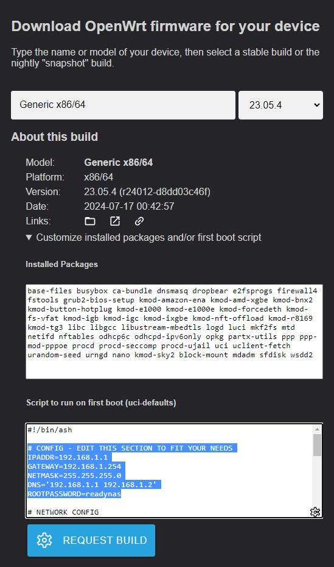

# Prepare a USB boot key for firmware flashing purpose

## Pre-requisites

You will need a 4GB (or more) USB STORAGE SUPPORT.

## Prepare OpenWRT firmware image
- Go to https://firmware-selector.openwrt.org/.
- Select "Generic x86/64" in the "Model" form select input.
- Select last OpenWRT version (NOT SNAPSHOT !).
- Develop the "Customize installed packages and/or first boot script" and add the following.packages names in the "Installed packages" text area :
```
kmod-sky2 block-mount mdadm sfdisk wsdd2
```
- add the content of [scripts/01_first_run_setup.sh](https://github.com/lspg/openwrt-readynas-pro-2/raw/main/scripts/01_first_run_setup.sh) script into the "Script to run on first boot" text area.
- Edit the first run script config section to fit your needs.
- Clic the "Request build" button to build the image.
- Download the "COMBINED (SQUASHFS)" or "COMBINED (EXT4)" compressed image.

	

## About OpenWrt firmware image choice

RNDP2XXX BIOS is **NOT** EFI.

Refering to https://openwrt.org/docs/guide-user/installation/openwrt_x86 :
|Feature| ext4-combined | squashfs-combined |
|-:|:-:|:-:|
|Extroot|Yes|No|
|Failsafe Mode|No|Yes|
|Factory Reset|No|Yes|

OpenWRT will be installed on EMMC which is only 125MB. 

If you want to expand the root filesystem to install apps that require more than a few megabytes of storage (ie: databases...), then choose the ext4-combined and go for the extroot feature.
If your more into having a safer product for production use (ie small office), then choose squashfs-combined.

Before making your choice, fell free to read more about :
- [Should I chose ext4 or squashfs image for OpenWrt?](https://openrouters.com/docs/openwrt-chose-ext4-or-squashfs-image/)
- [Official doc : OpenWrt on x86 hardware (PC / VM / server)](https://openwrt.org/docs/guide-user/installation/openwrt_x86)

## Prepare the boot key
I'll be using Lubuntu live iso image to boot to a debian based live system without having to install anything so we can flash the NAS with openwrt firmware, even if the target device does not have any network connection.
- Get the Lubuntu ISO from https://lubuntu.fr/
- Flash it to the USB key with Rufus
- Create a "firmware" directory in the usb key root directory.
- Uncompress the openwrt firmware you downloaded in step 1 in this directory.
It should give you something like :
	```
	/MYUSBKEYDRIVE/firmware/openwrt-23.05.4-0b9e37d1c62e-x86-64-generic-squashfs-combined.img
	```
- Finally, we need to tell linux to activate the console on the serial port.
Edit /boot/grub/grub.cfg on the usb key and change
	```
	linux	/casper/vmlinuz  --- quiet splash
	```
	into
	```
	linux	/casper/vmlinuz console=ttyS0,115200n8 ---
	```
- Eject the key.

[> Step 2 : Connect to serial port and BIOS setup](02_connect_to_serial_port.md)