# Connect to serial port and BIOS setup

Since there is no standard vga output plug, we need to connect a USB to TTL adaptor to the NAS ttl serial port at the bottom left of the backside.
Remove the small sticker to get access to the 4 pins.

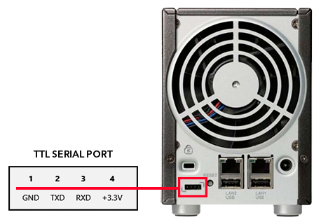

My TTL adaptor is using the very well known FTDI FT232 chipset.
You can easily find one for a few boxes.

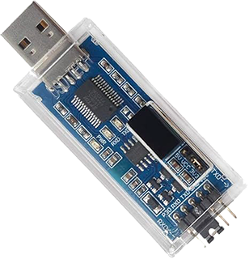

## Connect the USB to TTL adaptor to the NAS

Setup the adaptor to +3.3V (using a jumper on the adaptor).
Connect the GND, TXD and RXD pins between USB TTL adaptor and the NAS.

**DO NOT CONNECT VCC**, it might fry your adaptor and it is already powered by USB connection to your PC.

Knowing that and refering to the picture above :

| USB PINS | | NAS PINS |
|:-:|:-:|:-:|
|GND|----|1|
|TXD|----|2|
|RXD|----|3|
|VCC|**DO NOT CONNECT**|4|

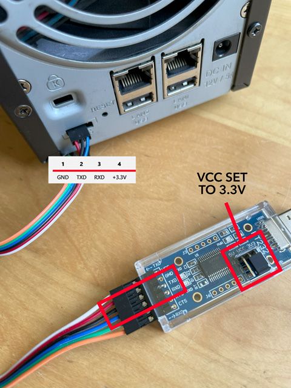

- If you swap TX with RX you'll just get garble characters or no display at all.
- You might have more pins on the USB to TTL adaptor, but we won't use them.

## Connect the PC to the serial port console with PUTTY (Windows) or zTerm (Mac)

Plug the USB to TTL adaptor to your PC or Mac. It should have a led lighting up on it.
Check the COM port number in the Windows device manager.

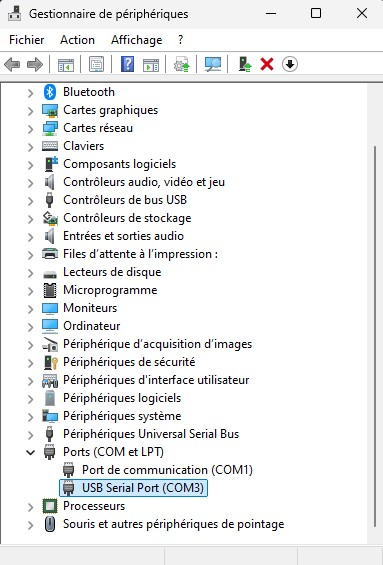

Start Putty and setup the connection as below, using the port number you just got in the device manager :

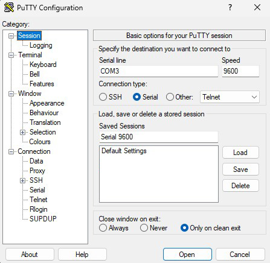
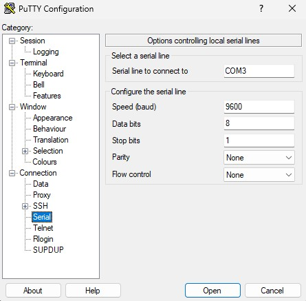

Save your settings and click the "Open" button to start the connection and show the terminal.

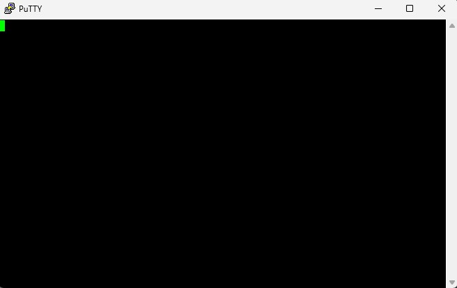

## BOOT AND BIOS SETUP

If you don't do this step, it might work as it for debian or ubuntu server installations, but you'll get garble characters as soon as OpenWRT will start booting.

- Power on the NAS
- Press "DEL" key as soon as the invite appears on the terminal.
  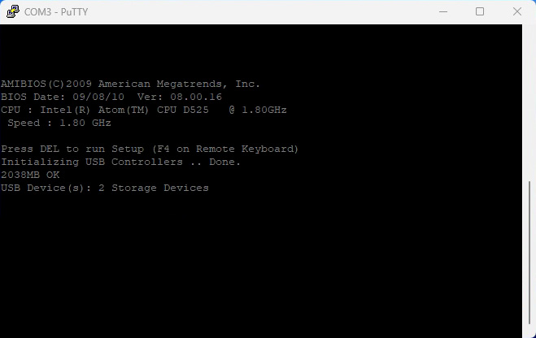
- Make the following changes :
  - Advanced > CPU Configuration > Enable "**Intel SpeedStep tech**"
  	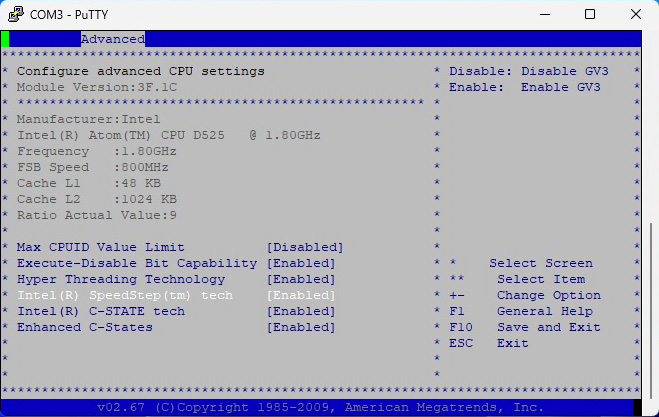
  - Advanced > Hardware Health Configuration > **Fan 1 Mode Setting** > Set to "**Automatic mode**"
	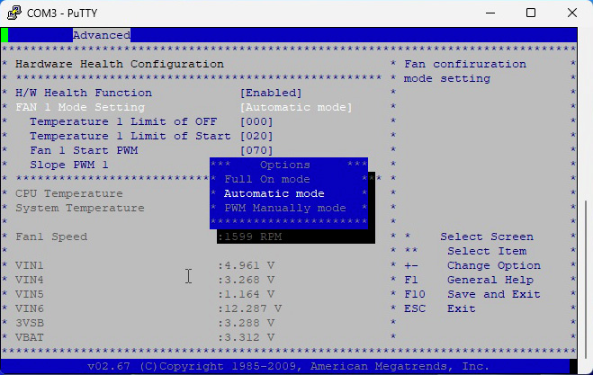
  - Advanced > Remote Access Configuration > **Serial Port Mode** > Set to "**115200 8,n,1**"
	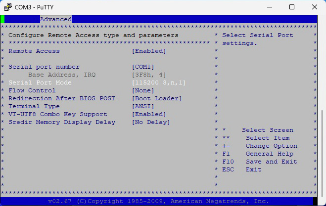
- Save and exit BIOS.
- Power off the NAS (we need to change Putty serial settings as well.)
- Close and restart Putty.
- Change the serial port speed to 115200.
- Save your settings to a new save name.
- Open the connection.

We are now ready to boot the linux live iso prepared in [phase 1](01_prepare_usb_boot_key.md).

- [< Step 1 : Prepare a USB boot key for firmware flashing purpose](01_prepare_usb_boot_key.md)
- [> Step 3 : Boot and flash firmware](03_boot_and_flash_firmware.md)